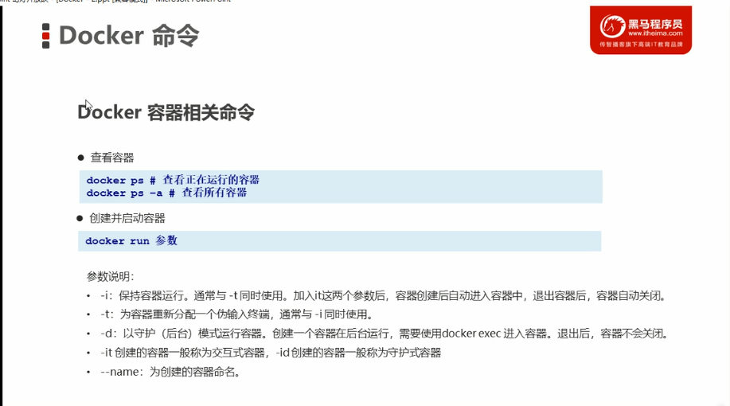

# Docker commands on images
Check local images  
```
docker images
```
Search for an image
```
docker search [name]
```
Download an image
```
docker pull [name]
docker pull [name] : [version]
```
Remove an image
```
docker rmi [image id]  
docker rmi [name] : [version]  
```
# Docker commands on creating containers
Create a container from an image. The it stands for open an interactive terminal, enter exit to quit, the container shall stop if exit.  
```
docker run -it --name=mongo mongo /bin/bash
```
The id stands for creating and starting a container in background, if a container is created in this way, then you can use exec command to enter and exit to quit. The container shall NOT stop if exit.
```
docker run -id --name=mongo mongo 
docker exec -it [container name] /bin/bash
```
Check all running containers. Add -a to see all containers.
```
docker ps
docker ps -a
```


# Docker commands on executing containers
```
docker start [container name]
docker stop [container name]
docker rm [container name]
docker inspect [container name]
```
# Docker commands on volume
Create and attach a volume when creating container.  
The first part is the directory in the system.  
The second part is the directory in the container.  
It is allowd to create multiple data volumes by adding multiple
-v .... commands.
``` 
docker run -id --name=test -v /docker_volumes/data:/root/data_container mongo
```
Create a container to be used as volume. The directory specified is the directory in the container.
```
docker run -it --name=volume -v /volume mongo
```
Use another container as volume:
```
docker run -it --name=test --volumes-from volume mongo
```
# Docker file
## There are two ways to create and share an image.
- ## 1 Packing and unpacking [not used very often]
```
docker commit [container id] [your image name]:[your image version_num]
docker save -o [xxx.tar/xxx.zip] [your image name]:[your image version_num]
docker load -i [zip file name]
```
- ## 2 Dockerfile
